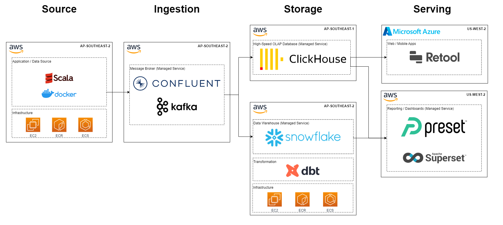

# eventsim Data Streaming Project

## Table of Contents
- [Source datasets](#source-datasets)
- [Solution architecture](#solution-architecture)
- [Codebase](#codebase)
- [Getting started](#getting-started)

This data engineering project involves pulling data streams from a mock music streaming service event simulator into Confluent via Kafka, then passing those streams simultaneously to Snowflake and ClickHouse (each modelled by CI/CD-powered dbt projects) and then visualizing them in Preset. The ClickHouse data is also populated into the custom app tool Retool to create a data app POC.

The Snowflake batch data served in Preset is modelled into facts and dims as well as a One Big Table to enable sophisticated BI dashboards. 

<p align="center"></p>


The ClickHouse data streaming into Preset is used to power real-time operational analytics use cases. 
<p align="center"></p>

The ClickHouse data streaming into Retool is used to create an interactive data app, allowing navigation across points of interest in the streamed data.

<p align="center"></p>


## Source dataset


[Eventsim](https://github.com/Interana/eventsim) - synthetic music streaming service data simulator written in Scala code. The original repo hasn't been maintained for 7+ years, so we based the project code on GitHub user [viirya's forked repo](https://github.com/viirya/eventsim) that updated the Scala code and relevant library dependencies to make the code work with more recent versions of Scala. We then extended this to work with Confluent in the cloud (rather hastily to meet project timelines - TBD making this into a proper extension).


## Solution architecture



Source: **Eventsim** - Scala application running in ECS container

Ingestion: **Apache Kafka** - managed service via **Confluent**

Storage: **ClickHouse** for real-time OLAP storage, **Snowflake** for batch storage.

Transformation: **dbt** projects for Snowflake and ClickHouse each, running in ECS container. 

CI/CD: **GitHub Actions** triggers CI/CD pipelines for both dbt projects. The linting tool SQLFluff is applied to SQL code during the CI process, flagging any issues in the code syntax. 

Serving: **Preset** for dashboards. **Retool*** as a simple data app PoC. 

***Note:** Retool does not allow syncing code to existing repositories so is only available online.


## Codebase

### application/eventsim

The `application/eventsim` folder contains the source data application code, the application Dockerfile, and the schemas for Confluent (if you wish to use them).

### infrastructure

The `infrastructure` folder contains relevant Terraform code to start up the application - WIP on hold for now.

### warehouse/clickhouse

The `warehouse/clickhouse` folder contains the ClickHouse dbt project with each of the 4 Kafka streams defined as views and a Dockerfile for the dbt project image to run in ECS.

### warehouse/snowflake

The `warehouse/clickhouse` folder contains the ClickHouse dbt project with each of the 4 Kafka streams transformed into staging models, which are then transformed into dimension and fact tables, as well as a Dockerfile for the dbt project image to run in ECS.


## Getting started

### Streaming Kafka data from eventsim
- A Dockerfile is provided to build eventsim to run as required
- Add a file for storing environment variables. We recommend doing this in the `application/eventsim` folder for local development
- This file must have the following schema:

```bash
# Required connection configs for Kafka producer, consumer, and admin
# bootstrap.servers
BOOTSTRAP_SERVERS=<YOUR CONFLUENT URL AND PORT>
# security.protocol
SECURITY_PROTOCOL=SASL_SSL
# sasl.jaas.config
SASL_JAAS_CONFIG=org.apache.kafka.common.security.plain.PlainLoginModule required username='<YOUR CONFLUENT API ID>' password=<YOUR CONFLUENT API KEY>;
# sasl.mechanism
SASL_MECHANISM=PLAIN

# Required for correctness in Apache Kafka clients prior to 2.6
client.dns.lookup=use_all_dns_ips

# Best practice for higher availability in Apache Kafka clients prior to 3.0
session.timeout.ms=45000

key.serializer=org.apache.kafka.common.serialization.ByteArraySerializer
value.serializer=org.apache.kafka.common.serialization.ByteArraySerializer

# Best practice for Kafka producer to prevent data loss
acks=all
```

- Build the Docker image. At the moment, the following command is used: `CMD ./bin/eventsim -c configs/Guitar-config.json --from 90 --nusers 20 -k 1`. This will simulate 90 prior days of data, with 20 fake users. Feel free to change these as required. Keep the -k parameter to publish to Confluent, or remove it to output to file only.
- If running locally, use `docker run --env-file=.env -t <YOUR IMAGE TAG>` to include environment variables

### Setting up Confluent

- [Sign up](https://confluent.cloud/signup) for a free Confluent trial. 
- Within Confluent, create an Environment with default settings. Make sure you enable [Schema Registry](https://docs.confluent.io/cloud/current/get-started/schema-registry.html#quick-start-for-schema-management-on-ccloud) in your environment to enable the Snowflake Kafka connector.
- Within your Environment, create a Cluster.
- Within the Cluster, go to Topics to set up the relevant topics - `auth_events`, `listen_events`, `page_view_events`, and `status_change_events`.

### Streaming eventsim data into Snowflake via Kafka connector

- [Sign up](https://signup.snowflake.com/) for a free Snowflake trial. Make sure to create your trial account in the same region as your Confluent account.  Log into your Snowflake account. 
- In order to create a Snowflake Sink Connector, within Snowflake, set up the necessary connection authentication key-pair, Snowflake database, schema, user role [per these instructions](https://docs.confluent.io/cloud/current/connectors/cc-snowflake-sink.html).
- Within Confluent, in your Cluster, go to Connectors, create a Snowflake Sink Connector, enabling streaming for the topics and fillng in the necessary credentials and settings to start streaming.

### Streaming eventsim data into ClickHouse
- [Sign up](https://clickhouse.com/) for a Clickhouse trial.
- Create four tables in Clickhouse's `default` database - the scripts to create these are in the warehouse/clickhouse/table-definitions folder:
    * `auth_events`
    * `listen_events`
    * `page_view_events`
    * `status_change_events`

- Create four HTTP sinks in Confluent - one for each topic/table created in a previous step. These must have the following configuration:
    * HTTP URL: `https://<YOUR CLICKHOUSE URL>:8443?query=INSERT%20INTO%20default.table_name%20FORMAT%20JSONEachRow` (where `table_name` = the topic you're sinking)
    * Username: default
    * Password: Your Clickhouse password
    * Endpoint Authentication Type: BASIC
    * Input Kafka record value format: JSON
    * HTTP Headers: Content-Type: application/json
    * Request Body Format: json
    * Batch Max Size: 1000

### Installing and running dbt

Start up your virtual environment as necessary and [install dbt](https://docs.getdbt.com/docs/get-started/installation) via the command `pip install dbt-core` and then also install the [Snowflake](https://docs.getdbt.com/reference/warehouse-setups/snowflake-setup) and [ClickHouse](https://docs.getdbt.com/reference/warehouse-setups/clickhouse-setup) connectors (`pip install dbt-snowflake`, `pip install dbt-clickhouse`). 

### Deploying dbt

There are task definitions in both Clickhouse and Snowflake dbt projects to allow automated deployment to an Amazon ECS cluster. These tasks must be created manually in ECS first, with the same names as defined in the prod and preprod task definitions.

The following secrets must be set up to run the CI/CD pipelines properly:
- `AWS_ACCESS_KEY`: Your AWS access key ID
- `AWS_SECRET_KEY`: Your AWS secret key
- `CH_HOST`: Clickhouse instance URL (not including port - this is configured in profiles.yml)
- `CH_PASSWORD`: Clickhouse instance password
- `DBT_PROFILE_SNOWFLAKE_ACCOUNT`: Snowflake instance URL
- `DBT_PROFILE_USER`: `Snowflake account username
- `DBT_PROFILE_PASSWORD`: Snowflake account password

These are all injected into various environment variables etc. during the build and deploy process.
